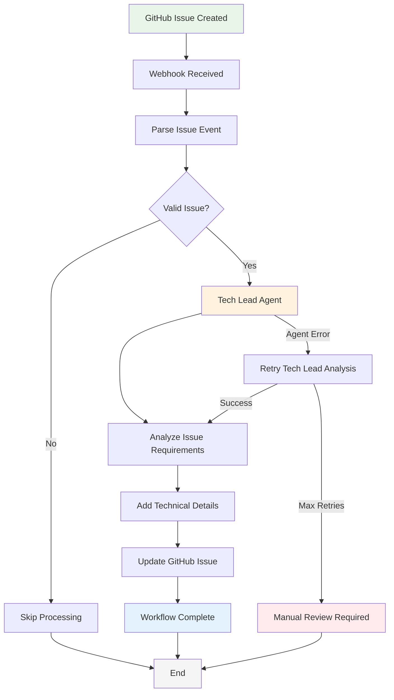

# Simple Tech Lead Enrichment Workflow

## Overview

This chart shows a minimal workflow where GitHub issues are automatically enriched with technical details by a tech lead agent, without proceeding to implementation.

## Workflow Diagram



## Process Steps

1. **Issue Creation**: Developer creates a new GitHub issue
2. **Webhook Processing**: System receives and parses the webhook event
3. **Validation**: Check if issue meets criteria for tech lead review
4. **Tech Lead Analysis**: AI agent analyzes the issue and requirements
5. **Detail Addition**: Agent adds technical specifications, implementation notes, and requirements breakdown
6. **Issue Update**: Enhanced details are added to the GitHub issue as comments or body updates
7. **Completion**: Workflow ends with enriched issue ready for future processing

## Example Tech Lead Enhancement

**Original Issue:**
```
Title: Add user authentication
Body: We need to add login functionality to the app
```

**After Tech Lead Enhancement:**
```
Title: Add user authentication
Body: We need to add login functionality to the app

## Technical Analysis (Added by Tech Lead Agent)

**Requirements:**
- JWT-based authentication system
- Login/logout endpoints
- Password hashing with bcrypt
- Session management
- Protected route middleware

**Implementation Approach:**
- Create authentication middleware
- Add user service layer
- Implement JWT token generation/validation
- Update existing routes to use auth middleware

**Estimated Complexity:** Medium (2-3 days)
**Dependencies:** jsonwebtoken, bcrypt libraries
```