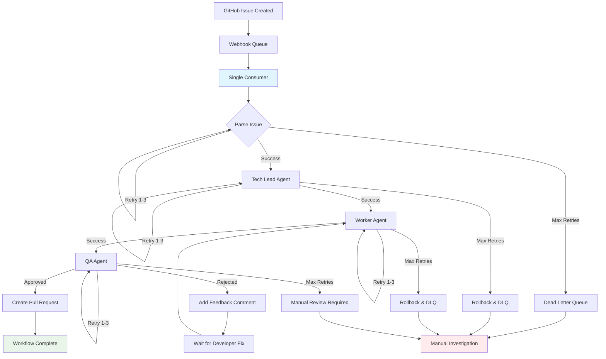
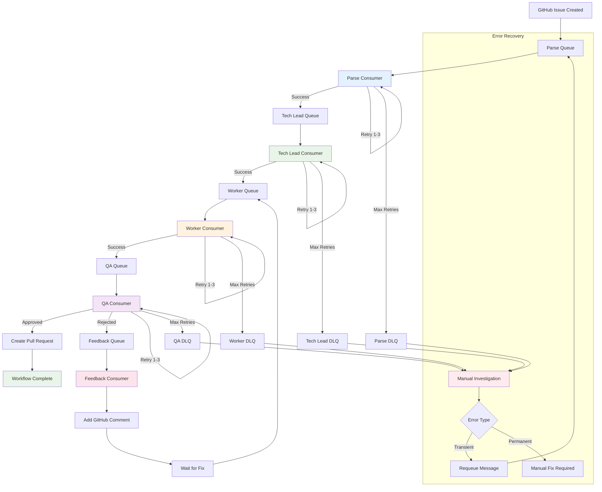
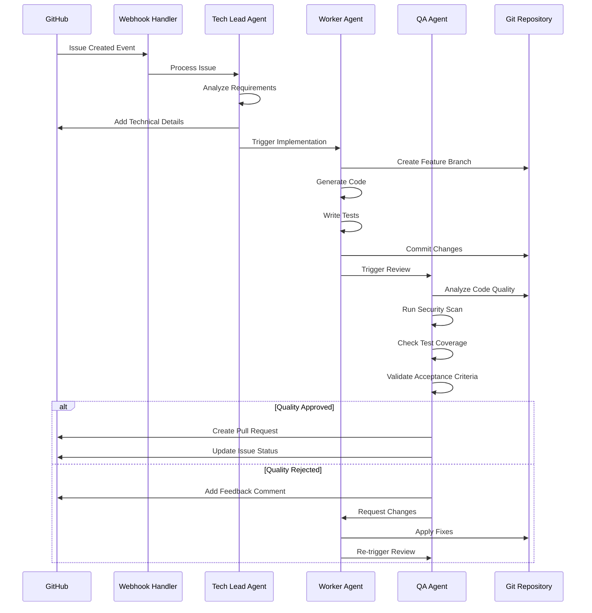

# GitHub Issue-Driven Workflow System Design

## Overview

This document outlines two architectural approaches for implementing a GitHub issue-driven workflow system that automatically creates branches, assigns AI agents, and manages development tasks based on GitHub issue events.

## Design 1: Single Consumer Architecture

### Architecture Overview

A single consumer service handles all workflow steps sequentially:

```
GitHub Webhook → Queue → Single Consumer → All Processing Steps
```

### Workflow Steps

1. **Event Parsing**: Parse incoming GitHub webhook payload
2. **Branch Creation**: Create feature branch from main
3. **Agent Assignment**: Determine and assign appropriate AI agent
4. **Status Updates**: Update issue with progress and results

### Example Workflow

```typescript
class WorkflowProcessor {
  async processIssue(webhookPayload: GitHubWebhook) {
    try {
      // Step 1: Parse event
      const issueData = this.parseIssueEvent(webhookPayload);

      // Step 2: Create branch
      const branch = await this.createBranch(issueData);

      // Step 3: Assign agent
      const agent = await this.assignAgent(issueData);

      // Step 4: Execute work
      const result = await agent.execute(issueData, branch);

      // Step 5: Update status
      await this.updateIssueStatus(issueData, result);
    } catch (error) {
      await this.handleError(error, webhookPayload);
    }
  }
}
```

### Error Handling & Retries

- **Single Retry Point**: All retries handled at the consumer level
- **State Recovery**: Must track which step failed to resume properly
- **Partial Failure**: If step 3 fails, steps 1-2 may need rollback
- **Retry Strategy**: Exponential backoff with maximum 3 attempts

## Design 2: Multi-Consumer Architecture

### Architecture Overview

Specialized consumers handle individual workflow steps with event-driven communication:

```
GitHub Webhook → Parse Queue → Parse Consumer → Branch Queue → Branch Consumer → Agent Queue → Agent Consumer → Status Queue → Status Consumer
```

### Workflow Steps

Each step is handled by a dedicated consumer:

1. **Parse Consumer**: Processes webhook, publishes to branch queue
2. **Branch Consumer**: Creates branch, publishes to agent queue
3. **Agent Consumer**: Assigns and executes agent work, publishes to status queue
4. **Status Consumer**: Updates GitHub issue status

### Example Workflow

```typescript
// Parse Consumer
class ParseConsumer {
  async process(webhookPayload: GitHubWebhook) {
    const issueData = this.parseIssueEvent(webhookPayload);
    await this.publishToQueue('branch-creation', {
      issueId: issueData.id,
      repository: issueData.repository,
      title: issueData.title,
      body: issueData.body,
    });
  }
}

// Branch Consumer
class BranchConsumer {
  async process(issueData: IssueData) {
    const branch = await this.createBranch(issueData);
    await this.publishToQueue('agent-assignment', {
      ...issueData,
      branchName: branch.name,
    });
  }
}

// Agent Consumer
class AgentConsumer {
  async process(data: IssueWithBranch) {
    const agent = await this.assignAgent(data);
    const result = await agent.execute(data);
    await this.publishToQueue('status-update', {
      ...data,
      result: result,
    });
  }
}

// Status Consumer
class StatusConsumer {
  async process(data: IssueWithResult) {
    await this.updateIssueStatus(data);
  }
}
```

### Error Handling & Retries

- **Individual Retry Logic**: Each consumer handles its own retries
- **Dead Letter Queues**: Failed messages moved to DLQ for manual intervention
- **Step Isolation**: Failure in one step doesn't affect others
- **Retry Strategy**: Per-step exponential backoff with different max attempts

## Comparison

### Single Consumer Pros

- **Simplicity**: Easier to understand and debug
- **Atomicity**: All-or-nothing processing
- **Lower Infrastructure**: Fewer moving parts
- **Consistent State**: Single point of state management

### Single Consumer Cons

- **Scalability**: Bottleneck at single consumer
- **Resource Usage**: Must handle all processing types
- **Recovery Complexity**: Must track partial completion
- **Blast Radius**: Single failure affects entire workflow

### Multi-Consumer Pros

- **Scalability**: Independent scaling per step
- **Specialization**: Optimized consumers per task type
- **Fault Isolation**: Failures contained to specific steps
- **Parallel Processing**: Multiple workflows can be at different stages

### Multi-Consumer Cons

- **Complexity**: More components to manage
- **Infrastructure Overhead**: Multiple queues and consumers
- **Eventual Consistency**: Harder to track overall state
- **Debugging**: Distributed tracing required

## Visual Workflow Diagrams

### Single Consumer Architecture Flow



### Multi-Consumer Architecture Flow



### Autonomous Agent Interaction Flow



## Recommended Approach

For initial implementation: **Single Consumer** for simplicity and faster development.

For production scale: **Multi-Consumer** for better fault tolerance and scalability.

Consider implementing the single consumer first, then evolving to multi-consumer as requirements grow.

## Error Handling Best Practices

### Both Approaches

- Implement comprehensive logging and monitoring
- Use structured error codes for different failure types
- Maintain audit trail of all workflow steps
- Implement circuit breakers for external API calls
- Use idempotent operations where possible

### Retry Strategies

- **Transient Errors**: Immediate retry with exponential backoff
- **Rate Limiting**: Respect GitHub API limits with proper delays
- **Permanent Errors**: Move to dead letter queue immediately
- **Timeout Handling**: Set appropriate timeouts for each operation type
